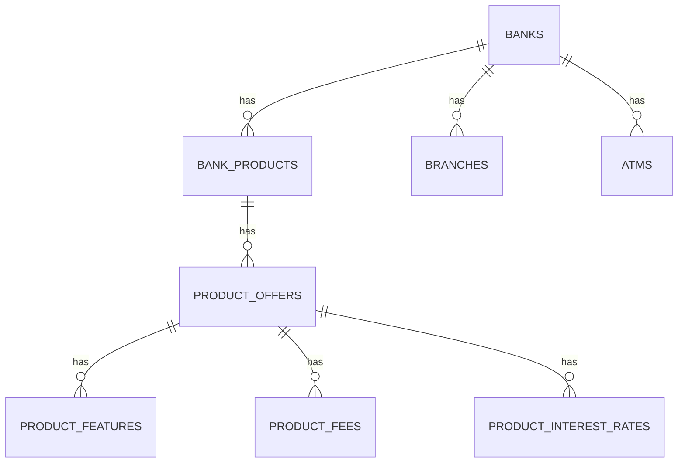
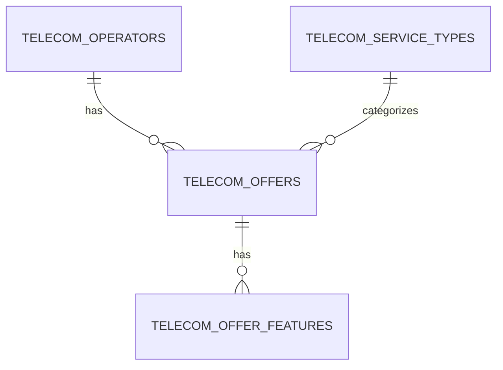
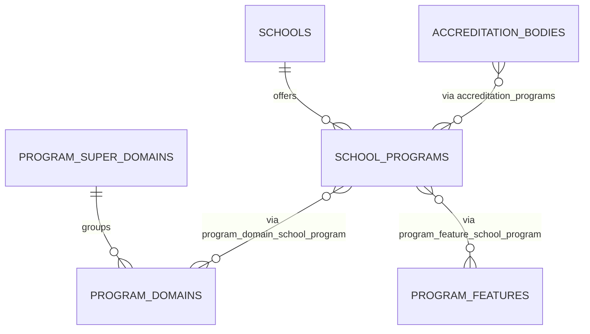
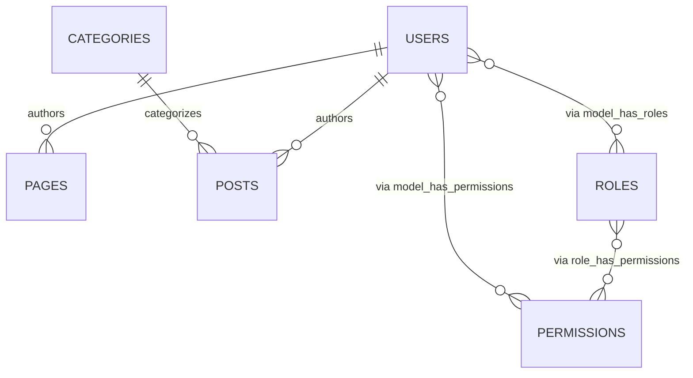

# 🌍 Comparek Platform

Comparek is a **service comparison platform for West Africa**, starting in Senegal.  
It allows users to compare **Telecom offers, Banks, and Higher Education programs** in a transparent, data-driven, and user-friendly way.  

## 🎯 Mission
- Provide **neutral and up-to-date comparisons** of essential services.  
- Help users make **better financial, academic, and telecom decisions**.  
- Build **trust** with institutions through accreditation, transparency, and data.  

Comparek is built with **Laravel 12**, **Livewire 3**, and **Bootstrap 5**, ensuring a modern stack that is scalable, fast, and maintainable.

---

# 🚀 Getting Started

## 1️⃣ Requirements
- PHP 8.3+
- Composer
- Node.js & NPM
- MySQL 8+
- Laravel 12
- Git

## 2️⃣ Installation
Clone the repository:
```bash
git clone git@gitlab.com:webamadou/immoplus.git comparek
cd comparek
```

Install dependencies:
```bash
composer install
npm install
```

Copy and configure .env:
```bash
cp .env.example .env
php artisan key:generate
```
Set your database, mail, and cache credentials.
Run migrations & seeders:
```bash
php artisan migrate --seed
```
Compile frontend assets:
```bash
npm run dev
```
Start local server:
```bash
php artisan serve
```

App will be available at http://127.0.0.1:8000

# ⚙️ Tech Stack
- Backend: Laravel 12 
- Frontend: Livewire 3 + Bootstrap 5 
- Database: MySQL 8 
- Authentication & Roles: Spatie Laravel Permissions 
- Datatables: Yajra (in some back-office modules)
- Editor: TinyMCE for CMS content

# 📊 Database UML Diagrams

The Comparek database is organized into modules: Banking, Telecom, Education, CMS/Auth, Scores & Media.
## 🏦 Banking Module


## 📱 Telecom Module


## 🎓 Education Module


## 📰 CMS & Auth Module


## 🌍 Combined Diagram (All Modules)
```mermaid
erDiagram
  BANKS ||--o{ BANK_PRODUCTS : has
  BANK_PRODUCTS ||--o{ PRODUCT_OFFERS : has
  PRODUCT_OFFERS ||--o{ PRODUCT_FEATURES : has
  PRODUCT_OFFERS ||--o{ PRODUCT_FEES : has
  PRODUCT_OFFERS ||--o{ PRODUCT_INTEREST_RATES : has
  BANKS ||--o{ BRANCHES : has
  BANKS ||--o{ ATMS : has
  TELECOM_OPERATORS ||--o{ TELECOM_OFFERS : has
  TELECOM_SERVICE_TYPES ||--o{ TELECOM_OFFERS : categorizes
  TELECOM_OFFERS ||--o{ TELECOM_OFFER_FEATURES : has
  SCHOOLS ||--o{ SCHOOL_PROGRAMS : offers
  PROGRAM_SUPER_DOMAINS ||--o{ PROGRAM_DOMAINS : groups
  SCHOOL_PROGRAMS }o--o{ PROGRAM_DOMAINS : "via program_domain_school_program"
  SCHOOL_PROGRAMS }o--o{ PROGRAM_FEATURES : "via program_feature_school_program"
  ACCREDITATION_BODIES }o--o{ SCHOOL_PROGRAMS : "via accreditation_programs"
  USERS ||--o{ PAGES : authors
  USERS ||--o{ POSTS : authors
  CATEGORIES ||--o{ POSTS : categorizes
  ROLES }o--o{ PERMISSIONS : "via role_has_permissions"
  USERS }o--o{ ROLES : "via model_has_roles"
  USERS }o--o{ PERMISSIONS : "via model_has_permissions"
  SCORE_CRITERIAS ||--o{ SCORE_VALUES : has
  IMAGES ||..|| (polymorphic) : "imageable_type + imageable_id"
```
